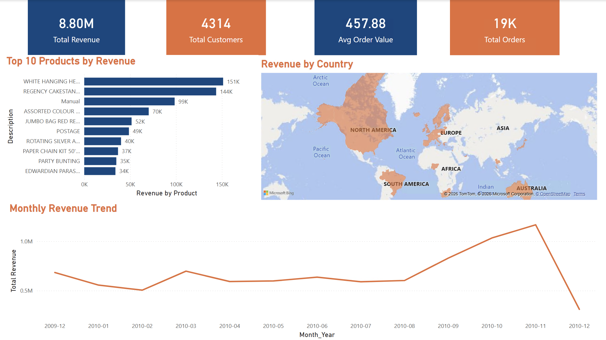
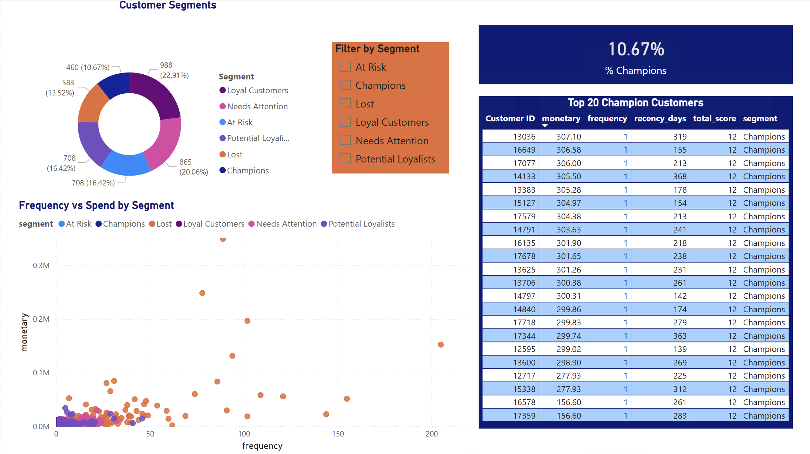
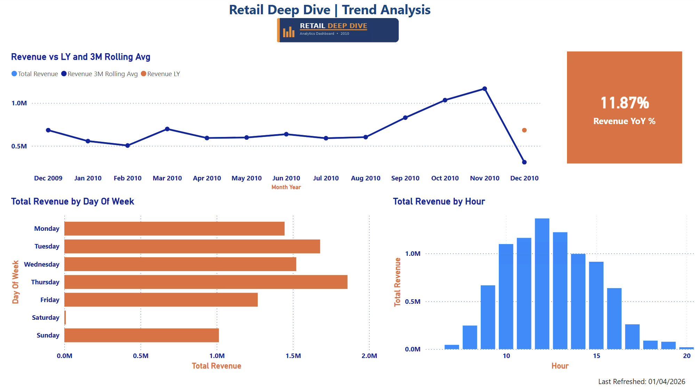

# Retail Deep Dive | UK E-Commerce Analytics

## Project Overview
End-to-end analytics project built on the UCI Online Retail II dataset.
The workflow cleans transactional data in Python, analyses customer and
revenue patterns in SQL, and presents business-ready insights in a 3-page
Power BI dashboard for a UK e-commerce retailer.

## Business Question
How can a retailer use transaction-level data to understand revenue drivers,
identify high-value customer segments, and improve campaign timing?

## Dataset Source
[UCI Online Retail II Dataset](https://archive.ics.uci.edu/dataset/502/online+retail+ii)
- 400,947 clean transactions after preparation
- Coverage: December 2009 to December 2010

## Tech Stack
- Python (Pandas, openpyxl) for cleaning and feature engineering
- SQLite + SQL for revenue analysis, cohort-style metrics, and RFM segmentation
- Power BI for dashboard design and storytelling

## Project Structure
```text
retail_deep_dive/
|-- data/
|   |-- raw/online_retail_II.xlsx
|   |-- cleaned/retail_cleaned.csv
|   |-- cleaned/retail_enriched.csv
|   |-- cleaned/rfm_base.csv
|   |-- cleaned/rfm_segments.csv
|   `-- retail.db
|-- scripts/
|   |-- 01_clean.py
|   |-- 02_feature_engineering.py
|   |-- 03_load_to_sql.py
|   |-- data_inspection.py
|   `-- eda_report.py
|-- sql/
|   |-- 00_sanity_check.sql
|   |-- 01_revenue_analysis.sql
|   |-- 02_customer_analysis.sql
|   `-- 03_rfm_segmentation.sql
|-- powerbi/
|   `-- Retail_DD_Day43_ReportPolish_Final.pbix
|-- screenshots/
|   |-- executive_summary.png
|   |-- customer_intelligence.png
|   `-- trend_analysis.png
|-- presentation_notes.md
|-- project_notes.md
`-- requirements.txt
```

## Key Findings
| Metric | Value |
|--------|-------|
| Total Revenue | £8.80M |
| Total Customers | 4,314 |
| Average Order Value | £457.88 |
| Total Orders | 19K |
| Champions (RFM) | 460 (10.67%) |
| Repeat Purchase Rate | 67% |
| Revenue YoY Growth | 11.87% |
| Peak Day | Thursday |
| Peak Hour | 12pm |

## Business Impact
- Identified a concentrated high-value segment: 460 Champions account for a disproportionate share of value.
- Highlighted retention risk: Lost and Needs Attention segments create clear targets for win-back campaigns.
- Surfaced timing insight: Thursday at 12pm is the strongest revenue window for promotions and email scheduling.
- Flagged expansion signal: EIRE is the strongest international market outside the UK.

## Dashboard Pages
### Executive Summary


### Customer Intelligence


### Trend Analysis


## How to Run
From the project root:

```bash
pip install -r requirements.txt
python scripts/01_clean.py
python scripts/02_feature_engineering.py
python scripts/03_load_to_sql.py
```

To explore the dashboard, open:

```text
powerbi/Retail_DD_Day43_ReportPolish_Final.pbix
```
